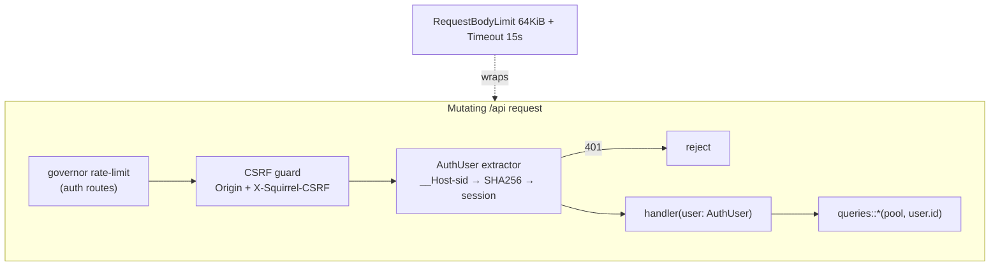
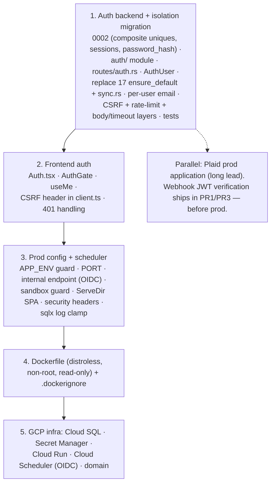

# Squirrel → Production: Hardened Auth, then GCP (Cloud Run + Cloud SQL)

## Context

Squirrel works end-to-end for a single local user but **cannot ship to production**: there is no
authentication, so a public deploy exposes everyone's brokerage data. The schema is *mostly*
multi-tenant (every user-owned table has `user_id`; every read query filters by it), and the only
thing tying the app to one identity is `db::queries::users::ensure_default` (17 handler call sites
in `src/`). This plan adds **auth first** (the production blocker), then productionizes for GCP
(single Cloud Run container serving SPA + `/api` same-origin so cookies work without CORS).

**This plan was adversarially red-teamed** along three axes — session/cookie, tenant isolation,
and credentials/crypto/deploy. That review **refuted the original "auth is just swap the user
source" framing**: there are real query-layer and data-model fixes required for correct isolation,
and several day-one DoS / CSRF / enumeration vectors. Those findings are folded in below and called
out inline as `[RT]`.

**Locked decisions:** open multi-user signup · DB-backed opaque session cookies (store only
SHA-256 of the token) · single Cloud Run container · Cloud Scheduler drives the alert cycle in prod
(in-process `tokio-cron` stays for local dev) · **`APP_ENV` (not `PLAID_ENV`) is the single source
of truth for security posture.**

---

## The three things that make this "robust" (read first)

1. **Tenant isolation is not free.** `[RT]` Four upserts use *globally* `UNIQUE` Plaid ids with
   `ON CONFLICT` that don't scope `user_id` (`accounts`, `transactions`, `plaid_items`), and alert
   emails go to a single global `ALERT_EMAIL_TO`. In sandbox, every user mints identical Plaid ids,
   so user B's sync silently rewrites user A's rows and all alerts land in one inbox. **Migration
   `0002` must re-key those uniques to `(user_id, plaid_*_id)` and email must go to `user.email`.**
2. **The auth endpoints are a DoS surface.** `[RT]` argon2 is intentionally expensive and sits on
   *unauthenticated* `/signup` + `/login`. Without rate limiting + body limits + concurrency caps,
   a few concurrent requests OOM the container and amplify the GCP bill. Rate limiting is **not
   deferred.**
3. **`SameSite=Lax` is not CSRF protection for financial mutations.** `[RT]` We add a required
   custom header + Origin check + `SameSite=Strict` + `__Host-` cookie, and invalidate any inbound
   session on login (login-CSRF / fixation).

---

## Shape

---

## Part A — Authentication & tenant isolation (build first)

### A1. Migration — `migrations/0002_auth.sql`

**Users & sessions:**
- `ALTER TABLE users ADD COLUMN password_hash TEXT;` — **nullable, no placeholder default.**
  `[RT-M1/M4]` A `NOT NULL DEFAULT ''` backfill creates accounts with empty-string hashes that
  become a bypass risk if any code path treats `''` specially. Instead: nullable column; the login
  path treats `NULL`/empty hash as **"cannot authenticate"** (never success).
- `DELETE FROM users WHERE email IS NULL;` then `ALTER TABLE users ALTER COLUMN email SET NOT NULL;`
  `[RT-M1]` `ensure_default` can have produced **more than one** null-email row across dev usage;
  the delete handles all of them (cascades to their Plaid data — fine for dev, call it out in a
  comment). Prod DB is fresh.
- New `sessions` table: `id UUID PK`, `user_id UUID NOT NULL REFERENCES users(id) ON DELETE CASCADE`,
  `token_hash BYTEA NOT NULL UNIQUE` (raw SHA-256 of the opaque token — never the token),
  `created_at`, `last_used_at`, `expires_at TIMESTAMPTZ NOT NULL`. Indexes on `token_hash` (unique)
  and `user_id`.

**Tenant-isolation fixes `[RT-C2/C3/C4]` (this is the part the original plan missed):**
- `plaid_items`: drop the global `UNIQUE (plaid_item_id)`; add `UNIQUE (user_id, plaid_item_id)`.
- `accounts`: drop global `UNIQUE (plaid_account_id)`; add `UNIQUE (user_id, plaid_account_id)`.
- `transactions`: drop global `UNIQUE (plaid_investment_transaction_id)`; add
  `UNIQUE (user_id, plaid_investment_transaction_id)`.
- `securities` stays globally keyed — it holds only public market data, no user rows `[RT-verified
  safe]`.

### A2. Query-layer changes `[RT — refutes "zero query changes"]`
- `crates/db/src/queries/plaid_items.rs::upsert` — `ON CONFLICT (user_id, plaid_item_id)`.
- `crates/db/src/queries/accounts.rs::upsert` — `ON CONFLICT (user_id, plaid_account_id)`.
- `crates/db/src/queries/transactions.rs::insert_ignore` —
  `ON CONFLICT (user_id, plaid_investment_transaction_id) DO NOTHING`.
- `crates/db/src/queries/users.rs`: add `create(pool, email, password_hash) -> User`
  (hard-codes `filing_status='single', taxable_income=0` — **never** accepts those from the request
  `[RT-M2]`), `find_by_email`, `find_by_id`, `list_all`. **Keep** `ensure_default` for test fixtures.
- `crates/db/src/queries/sessions.rs` (new): `create`, `find_valid_by_token_hash` (joins users,
  `WHERE expires_at > now()`), `touch_if_stale` (see A6), `delete`, `delete_all_for_user`,
  `delete_expired`.
- `crates/db/src/models.rs`: `email: String` (drop `Option`); add `password_hash: Option<String>`
  with `#[serde(skip_serializing)]`; add `Session`. **Do not derive `Debug` in a way that prints the
  hash** `[RT-L1]` — hand-roll `Debug` for `User` to redact `password_hash` (a stray
  `tracing::debug!(?user)` would otherwise leak it).

### A3. Auth module — `crates/api/src/auth/` (`mod.rs`, `password.rs`, `session.rs`, `extractor.rs`, `csrf.rs`)
- `password.rs` `[RT-H2]` — pin argon2 explicitly, do not use `default()`:
  `Argon2::new(Algorithm::Argon2id, Version::V0x13, Params::new(19_456, 2, 1, None)?)`.
  Hash with `SaltString::generate(&mut OsRng)` (fresh per-hash salt in the PHC string); verify with
  `PasswordHash::new(stored)?` + `verify_password`. A startup-built **dummy PHC hash** is held in
  state for the timing-equalization path (A4). Unit test asserts hashes start with `$argon2id$`.
- `session.rs` `[RT-M2]` — `new_token()` uses **`OsRng`** for 32 bytes, encodes
  `base64::URL_SAFE_NO_PAD`, returns `(raw, sha256_bytes)`. Round-trip unit test
  (generate → cookie → read → hash → matches stored). Expiry policy is explicit `[RT-M4]`:
  `expires_at = LEAST(now() + sliding_window(7d), created_at + absolute_cap(30d))`; cookie `Max-Age`
  = absolute cap.
- `extractor.rs` — `AuthUser(pub User)` via `FromRequestParts<AppState>`: read `__Host-sid` from
  `axum_extra` `CookieJar`, SHA-256, `find_valid_by_token_hash`, `touch_if_stale` (A6), return user;
  any miss → `AppError::Unauthorized`.
- `csrf.rs` `[RT-C1/C2]` — `axum::middleware::from_fn` applied to all mutating `/api` routes: reject
  (403) any non-GET/HEAD request whose `Origin`/`Referer` is present and not the app origin, **or**
  that lacks header `X-Squirrel-CSRF: 1`. Cross-site JS cannot set a custom header without a CORS
  preflight we never allow. Applied to `/api/auth/*` too (login-CSRF).
- `error.rs` — add `AppError::Unauthorized` → 401, fixed body `{"error":"unauthorized"}`. Change the
  `Plaid` arm to return a generic `"upstream error"` body (log the detail) `[RT-L5]` so Plaid
  internals don't leak in the 502.

### A4. Auth routes — `crates/api/src/routes/auth.rs` (new), merged in `routes/mod.rs`
- `POST /api/auth/signup {email,password}` — validate + **normalize** email `[RT-H3]` (`trim`, NFC,
  lowercase, RFC-length ≤254, conservative format check via `email_address` crate); validate
  password `[RT-H1/L3/L4]` (NFC-normalize; length 12–128 chars; reject the megabyte-password
  vector); argon2-hash; `users::create`; create session; set cookie; return `Json<User>`. Duplicate
  email → 409 (accepted enumeration trade-off for open signup; mitigated by rate limit + timing
  parity).
- `POST /api/auth/login {email,password}` `[RT-C2]` — fetch by normalized email. **If user not
  found, still run `verify_password` against the dummy hash** so both branches cost the same; on
  any failure return the same generic 401. On success: **delete any session referenced by an inbound
  cookie** (fixation/login-CSRF kill), create a fresh session, set cookie.
- `POST /api/auth/logout` — delete the current session row (even if cookie malformed), clear cookie
  with identical attributes `[RT-L5]`. 204.
- `POST /api/auth/logout-all` `[RT-H4]` — `sessions::delete_all_for_user`; surfaced as "log out
  everywhere".
- `GET /api/auth/me` — `AuthUser` → `Json<User>`.
- **Cookie** `[RT-H1/H2/M5]`: name `__Host-sid` in prod (`sid` in dev, since `__Host-` requires
  `Secure`), `HttpOnly`, `SameSite=Strict`, `Path=/`, **no `Domain`**, `Secure` gated on
  `config.cookie_secure` (= `APP_ENV != development`).

### A5. Replace `ensure_default` in handlers (17 sites + 1 missed) `[RT-H2]`
Add `user: crate::auth::AuthUser` and use `user.0`. Files/lines: `profile.rs` (27,41),
`portfolio.rs` (31,37,52,58), `tax.rs` (59,124,218), `alerts.rs` (31,40,50), `plaid.rs`
(51 + `connect_with_public_token` 125). `lots.rs::rebuild_lots(pool)` → `rebuild_lots(pool, user_id)`.
- **`crates/api/src/sync.rs:186` calls `rebuild_lots(pool)` and was absent from the original file
  list** — thread `item.user_id`: `crate::lots::rebuild_lots(pool, item.user_id)`. Without this the
  build breaks, or a "fix" rebuilds lots for the wrong user.
- `routes/tax.rs::simulate` and `routes/alerts.rs::mark_read` IDOR concerns are **closed** once
  `AuthUser` is wired, because the underlying queries already scope `user_id` `[RT-verified safe]` —
  no extra guards needed, but the isolation test (Verification) must prove it.

### A6. Per-user alert engine + per-user email `[RT-C1]` — `crates/api/src/alert_engine.rs`, `email.rs`, `config.rs`
- Split the three `ensure_default` sites into `evaluate_and_store_for_user(state, user)`,
  `send_pending_emails_for_user(state, user)`, `run_cycle_for_user(state, user)`, and
  `run_cycle_all_users(state)` iterating `users::list_all` (one user's failure must not abort the
  loop). `run_cycle_all_users` also calls `sessions::delete_expired` `[RT-M5]` (the in-process
  scheduler is off in prod, so cleanup must ride the hourly internal cycle).
- **`email::send` must take the recipient as a parameter**; `send_pending_emails_for_user` passes
  `&user.email`. Delete `ALERT_EMAIL_TO` as the recipient (keep only as an optional dev-only
  fallback). `[RT-C1]` This is the highest-impact leak: today every user's alerts would be mailed to
  one global inbox.
- `routes/alerts.rs::evaluate` runs `run_cycle_for_user(state, user.0)` (the calling user only).
- `touch_if_stale` `[RT-H3/M2]`: `UPDATE sessions SET last_used_at=now() WHERE id=$1 AND
  last_used_at < now() - interval '5 minutes'` — makes the per-request session write a no-op in
  steady state (kills the write-amplification DoS lever).

### A7. Global middleware layers `[RT-H1]` — `crates/api/src/lib.rs::build_app`
- `tower_http::limit::RequestBodyLimitLayer::new(64 * 1024)` and
  `tower_http::timeout::TimeoutLayer::new(Duration::from_secs(15))`, layered over the whole router.
- Add `"limit"`, `"timeout"`, `"fs"`, `"set-header"` to `tower-http` features (workspace `Cargo.toml`).
- Rate limiting `[RT-C1/M6]`: `tower_governor` on `/api/auth/{login,signup}` (e.g. ~10/min/IP),
  keyed on the real client IP from `X-Forwarded-For` (Cloud Run sets it via Google's front end), not
  the socket peer.

### A8. Route protection model
Fail-closed by construction: the `AuthUser` extractor is the gate. **Public** (no extractor):
`/health`, `/api/auth/{signup,login}`, `/api/plaid/webhook` (auth'd by signature, Part F),
`/api/internal/*` (auth'd by OIDC/bearer, Part C), and the static SPA.

---

## Part B — Frontend auth — `frontend/src/`
- `screens/Auth.tsx` (new) — login/signup toggle; posts to `/api/auth/*` (same-origin, cookie auto).
- `api/client.ts` `[RT-C1]` — every mutating request (`post`/`patch`/`delete`) sends
  `X-Squirrel-CSRF: 1`. On `res.status === 401`, throw a sentinel.
- `main.tsx` — `QueryCache` global error handler invalidates `me` on the 401 sentinel so `AuthGate`
  re-renders to login.
- `App.tsx` — `useMe` → `<AuthGate>`: loading → spinner; 401 → `<Auth/>`; success → existing routes
  (onboarding gate still works behind it).
- `api/hooks.ts` — `useMe`, `useLogin`, `useSignup`, `useLogout`, `useLogoutAll`; key `me: ["me"]`.
- `components/TopBar.tsx` — logout + "log out everywhere" buttons.
- `vite.config.ts` proxy already covers `/api`; dev uses `sid` (non-`__Host-`) over the HTTP proxy.

---

## Part C — Prod config, scheduler, internal endpoint

### `crates/api/src/config.rs` `[RT-H5]`
- **Introduce `APP_ENV` (`development|staging|production`), strict-parsed — unknown value is a hard
  boot error.** It is the single source of truth: `cookie_secure = (APP_ENV != development)`,
  startup guard fires on `APP_ENV == production`, `sandbox_connect` 403 on `APP_ENV != development`,
  `scheduler_enabled` default false unless `development`.
- Also make `PlaidEnv` parse strict (no silent sandbox default) so a `PLAID_ENV` typo can't downgrade
  posture.
- New fields: `app_env`, `port: Option<u16>` (Cloud Run `PORT`), `cookie_secure`,
  `scheduler_enabled`, `internal_api_token: Option<String>`.
- **Startup guard (prod):** require `token_encryption_key`, `plaid_client_id`, `plaid_secret`,
  `internal_api_token`; and **assert `cookie_secure == true`** `[RT-H2]`. Fail fast otherwise.
- **sqlx log clamp `[RT-M3/C5]`:** in `db::connect`, set
  `PgConnectOptions::log_statements(LevelFilter::Warn)` so `RUST_LOG=debug` cannot dump bound params
  (password hashes, session/Plaid tokens). Never derive `Debug`/`Serialize` on `Config`.

### `crates/api/src/lib.rs`
- Bind `0.0.0.0:{PORT}` when set, else `bind_addr`. Call `start_scheduler` only when
  `scheduler_enabled`.

### `routes/internal.rs` (new) `[RT-H5/M1]`
- `POST /api/internal/alerts/run` → `run_cycle_all_users`. **Prefer Cloud Run IAM/OIDC** (Cloud
  Scheduler invokes with an OIDC identity token; Cloud Run enforces the invoker role) over a shared
  secret. Keep `INTERNAL_API_TOKEN` Bearer as fallback, compared with `subtle::ConstantTimeEq` over
  hashes of both sides. Behind the body-limit/timeout layers.

### `routes/plaid.rs`
- `sandbox_connect` → 403 when `APP_ENV != development`.

### Security headers `[RT-M5]` — `build_app`
- `SetResponseHeaderLayer` stack: HSTS (prod), `X-Content-Type-Options: nosniff`,
  `Referrer-Policy: same-origin`, and a CSP with `frame-ancestors 'none'` (clickjacking) sized to
  the SPA's asset origins.

---

## Part D — Containerization — `Dockerfile`, `.dockerignore` `[RT-M5/M6]`
- Multi-stage: (1) `node:22-alpine` builds SPA → `dist/`; (2) `rust:1-bookworm` builds
  `cargo build --release -p api` (no DB needed — queries are runtime strings, so `SQLX_OFFLINE` is
  irrelevant; the `DEPLOYMENT.md` note about it is stale); deps cached in a separate layer.
  (3) Runtime: **`gcr.io/distroless/cc-debian12`** (no shell/package manager; we're on rustls so
  `cc` is enough), copy binary + `/migrations` + `dist/`, **non-root**, base image **pinned by
  digest**, `EXPOSE 8080`.
- Cloud Run service configured **read-only root filesystem**, dropped caps, min memory sized to
  argon2 params × max-concurrency, and a hard **max-instances** cap `[RT-C1]`.
- `.dockerignore`: `target/`, `node_modules/`, `frontend/dist/`, `.git/`, `.github/`.
- **Serve SPA from the binary** `[RT-M5]`: mount `ServeDir::new(static_dir).fallback(ServeFile::
  new(static_dir/"index.html"))` **after** `/api` and `/health` so SPA client routes fall back to
  `index.html`, but `/api/*` 404s are **not** swallowed into 200 HTML. Gated by `STATIC_DIR` so dev
  (Vite) skips it. (`ServeDir` already rejects `../` traversal.)

---

## Part E — GCP deploy (Cloud Run + Cloud SQL)
- **Cloud SQL Postgres 16** (smallest shared-core), DB `squirrel` + dedicated user. Connect via the
  built-in Cloud SQL connection over the unix socket: `DATABASE_URL=postgres://USER:PW@/squirrel?
  host=/cloudsql/<INSTANCE_CONN>`. `[RT-C3]` `sslmode=disable` is acceptable **only because** the
  socket is loopback-local inside the sandbox — add an inline comment scoping it to the unix-socket
  path and reconcile with `DEPLOYMENT.md` §3/§11 (which says `require`). Store the **password
  component** in Secret Manager, assemble the URL at deploy; never log it.
- **Artifact Registry** — push image tagged by git SHA.
- **Secret Manager → Cloud Run env:** DB password, `TOKEN_ENCRYPTION_KEY`, `PLAID_CLIENT_ID/SECRET`,
  `PLAID_WEBHOOK_URL`, SMTP creds, `INTERNAL_API_TOKEN` (if not using OIDC).
- **Cloud Run service:** Cloud SQL attached; env `APP_ENV=production` (or `staging`),
  `SCHEDULER_ENABLED=false`, `STATIC_DIR=/app/dist`, `RUST_LOG=info`; min 0–1 instances, hard
  max-instances. Migrations auto-run on boot (fine at 0–1; move to a one-shot Cloud Run Job +
  expand/contract when scaling >1 — note in `DEPLOYMENT.md`).
- **Cloud Scheduler** hourly → OIDC-authenticated POST `/api/internal/alerts/run`.
- **Domain + managed TLS** via Cloud Run domain mapping; set `PLAID_WEBHOOK_URL`; register Plaid
  redirect URIs.
- Wire Cloud Run liveness/readiness to `/health` (stays public). **CI:** add `cargo audit`
  `[RT-M6]`. CD via Workload Identity Federation — follow-up PR; existing `ci.yml` stays.

---

## Part F — Plaid production
- **Apply for Plaid production now** (review = days–weeks); run staging in prod infra with
  `PLAID_ENV=development` (now safe because `APP_ENV` drives posture, not `PLAID_ENV` `[RT-H5]`).
- **Webhook JWT signature verification ships BEFORE the public deploy, not "parallel/long-lead"**
  `[RT-H1/H4]` — it is the *only* auth on the one public mutating route, and `resync_item` is
  unscoped by user. In `routes/plaid.rs::webhook`: take `axum::body::Bytes`; read `Plaid-Verification`
  JWT; **pin `alg=ES256`, reject `none`/`HS256`** (alg-confusion bypass); fetch the verification key
  by `kid` from `/webhook_verification_key/get` and **cache by `kid` with a TTL + rotation**; verify
  the JWT, then assert its `request_body_sha256` equals SHA-256 of the **raw bytes** (constant-time);
  enforce `iat` freshness (~5 min, replay); only then parse JSON and branch. Any failure → 401, no
  `is_*` branch runs. Add per-item sync dedupe.
- Real Plaid Link UI in `Onboarding.tsx` (replace the sandbox shortcut) — separate follow-up.

---

## Reuse / new deps
- `crypto.rs` (AES-256-GCM, per-message random nonce) stays for **Plaid tokens**; passwords use
  argon2 — separate primitive, do not cross them `[RT-confirmed correct]`.
- Opaque token + `BYTEA` SHA-256 storage is correct — **do not** argon2 the session token
  `[RT-M2]`; it's 256-bit random, fast hash is right.
- **New deps (workspace `Cargo.toml`):** `argon2 = "0.5"`, `sha2 = "0.10"`,
  `axum-extra = { version="0.10", features=["cookie"] }`, `subtle = "2"`, `tower_governor = "0.4"`,
  `email_address = "0.2"`, `unicode-normalization = "0.1"`; `tower-http` add
  `["fs","limit","timeout","set-header"]`. For webhook JWT: `jsonwebtoken = "9"` (ES256).

## Critical files
**New:** `migrations/0002_auth.sql`; `crates/api/src/auth/{mod,password,session,extractor,csrf}.rs`;
`crates/api/src/routes/{auth,internal}.rs`; `crates/db/src/queries/sessions.rs`;
`frontend/src/screens/Auth.tsx`; `Dockerfile`; `.dockerignore`.
**Modified:** `crates/db/src/queries/{users,accounts,transactions,plaid_items,mod}.rs`,
`crates/db/src/models.rs`, `crates/db/src/lib.rs` (sqlx log clamp); `crates/api/src/{error,config,
lib,lots,alert_engine,email,sync}.rs`, `crates/api/src/routes/{mod,profile,portfolio,tax,alerts,
plaid}.rs`; `frontend/src/{App,main,components/TopBar,api/client,api/hooks}.tsx/ts`;
`Cargo.toml`; `DEPLOYMENT.md` (reconcile sslmode + migration strategy).

---

## Verification

**Integration (`cargo test`, `#[sqlx::test]` + `tower::ServiceExt::oneshot`)** — extend
`crates/api/tests/http.rs`. Add an `auth(app) -> (CookieJar, csrf_header)` helper that signs up a
user; existing tests attach the cookie + CSRF header. New tests:
- signup creates user+session+cookie · login sets cookie · **bad-creds and unknown-user both →
  identical generic 401** (and a coarse timing assertion that both run a verify) ·
  duplicate-signup → 409 · protected route w/o cookie → 401 · mutating request **without the CSRF
  header → 403** · mutating request with a **foreign `Origin` → 403** · logout deletes the row ·
  logout-all clears every session.
- **Isolation suite `[RT]`:** user A's cookie cannot read B's `/api/holdings`,`/api/tax/summary`,
  `/api/alerts`; A's `simulate` with B's `lot_id` → "unknown lot"; A's `mark_read` of B's alert →
  404; **two users sandbox-connecting the same institution keep separate `plaid_items`/`accounts`/
  `transactions` rows** (proves the composite-unique fix); **alert emails for B go to B's address,
  never a global one**.
- `password_hash` absent from every JSON response and from `?user` debug output ·
  empty/NULL-hash user cannot authenticate with any password (incl. `""`) · signup ignores extra
  body fields (`filing_status`/`id`).

**Local Docker:** `docker build` → run against docker-compose Postgres with `APP_ENV=development`:
signup → onboarding (sandbox) → dashboard; oversized body → 413; OIDC/bearer internal run returns a
summary.

**Frontend:** `cd frontend && npm run build`; manual login/logout/logout-all, 401-redirect on
expiry, refresh stays authed.

**GCP staging:** deploy with `APP_ENV=staging`, `PLAID_ENV=development`: migrations apply, signup,
Plaid link, dashboard renders, Cloud Scheduler (OIDC) triggers the cycle, expired sessions get
reaped, alert email delivered to the right address (Mailtrap/SES sandbox), `Secure`+`__Host-`
cookie confirmed in the browser.
